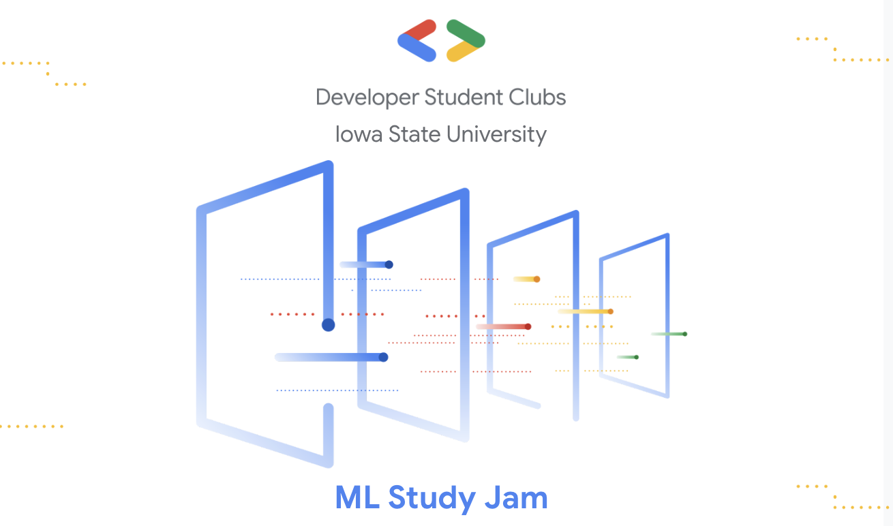

# ML-Study-Jam

## What is this?

ML Study Jam are 30 minute session that provide students a learning opportunity which takes 4 weeks of time leveraging Kaggle Courses. It includes hands-on assignments, tutoring, tech talks and group discussions.

## Curriculum

Below is the curriculum for the session

- Week 1: Intro to Python programming
  - Basics
  - Python Data Structures
  - Control Flow Statements
  - Functions
  - Classes
- Week 2: Data Analysis with Pandas
  - Creating, reading, writing
  - Indexing, selecting, assigning
  - Maps
  - Grouping and sorting
  - Data types and missing values
  - Renaming and combining
- Week 3: Basic Machine Learning concepts
  - Data Exploration
  - ML models
  - Model validation
  - Underfitting and Overfitting
- Week 4: Intermediate Machine Learning
  - Missing values
  - Categorical variables
  - Pipelines
  - Cross-validation
  - XGBoost

## Kaggle courses

Below are the corresponding kaggle courses for each week.

- Week 1: [Intro to Python](https://www.kaggle.com/learn/python)
- Week 2: [Pandas](https://www.kaggle.com/learn/pandas)
- Week 3: [Intro to Machine Learning](https://www.kaggle.com/learn/intro-to-machine-learning)
- Week 4: [Intermediate Machine Learning](https://www.kaggle.com/learn/intermediate-machine-learning)

## About the instructor

Ali Haider - Technical Lead of GDSC Iowa State University

Find him @ these links

- LinkedIn: https://www.linkedin.com/in/m-ali-haider/
- Email: mhaider@iastate.edu
- Github: https://github.com/allihaider
- Medium: https://medium.com/@m.allihaider
